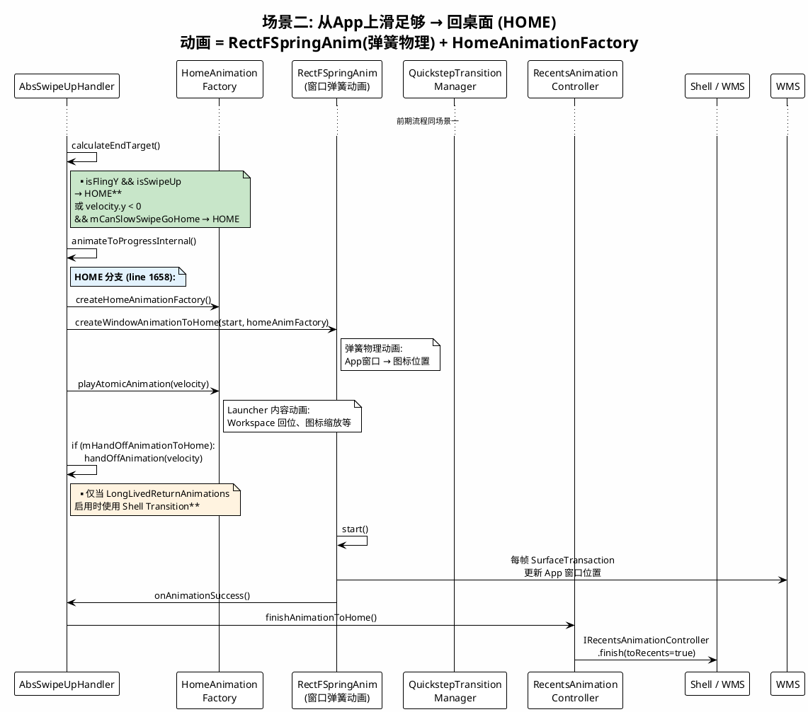
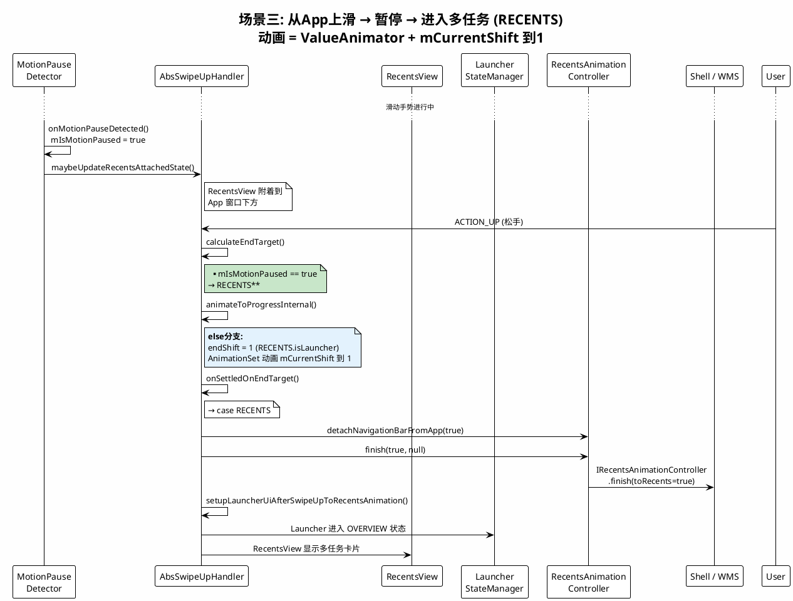
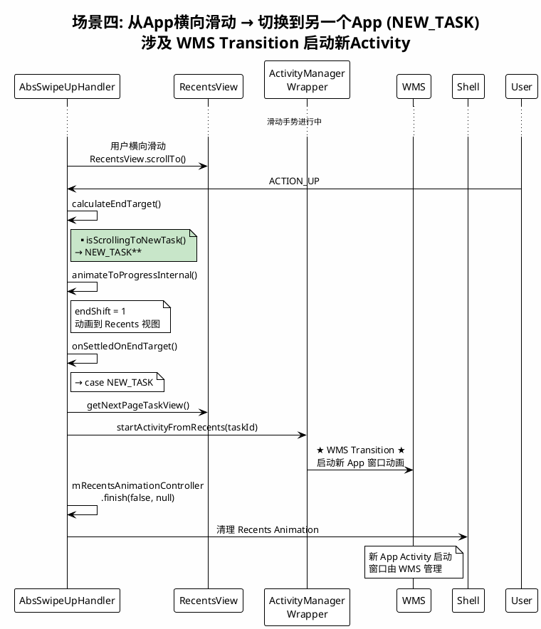
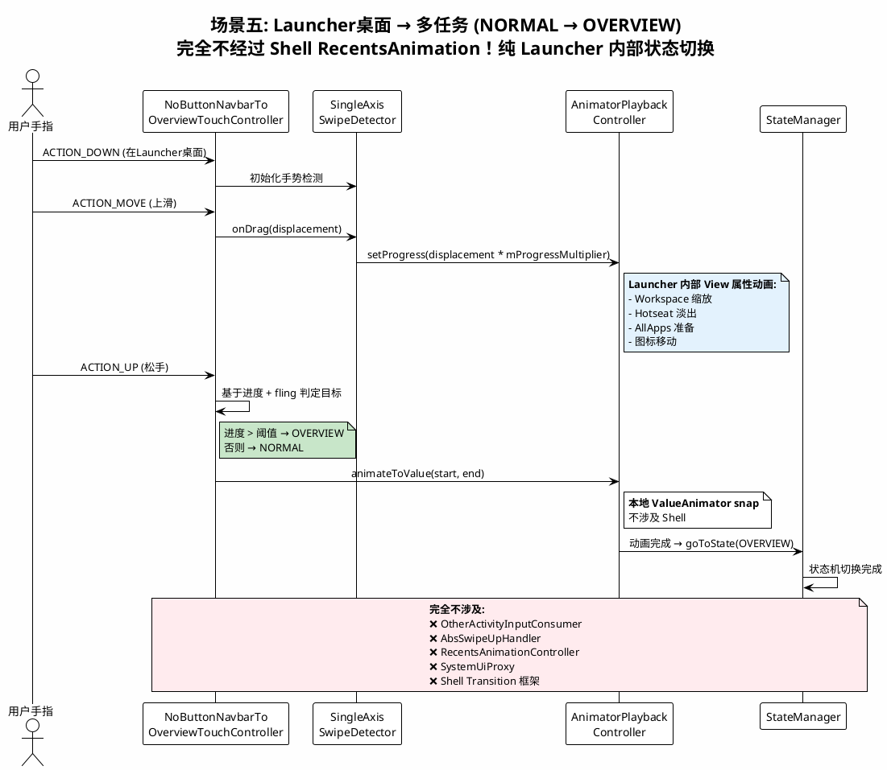
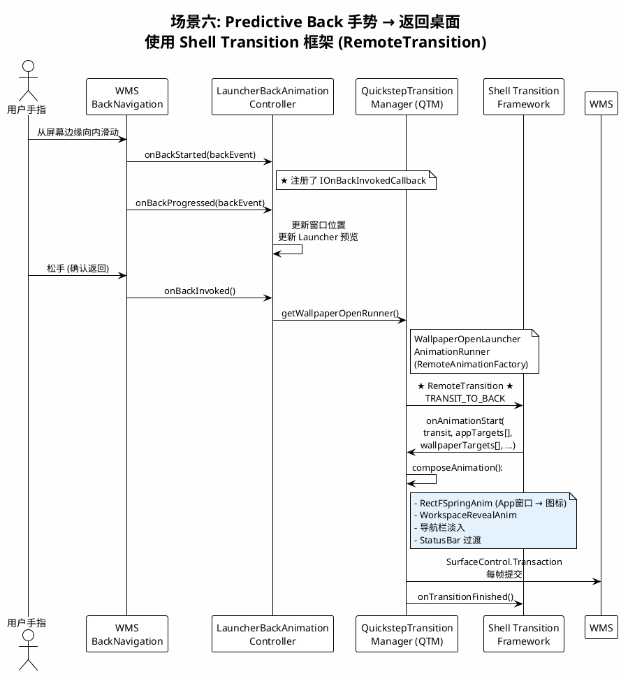
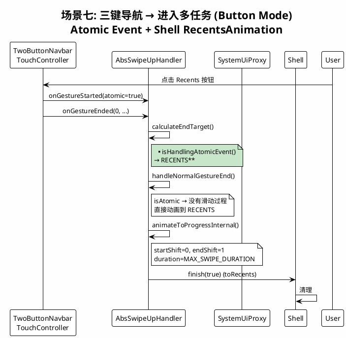
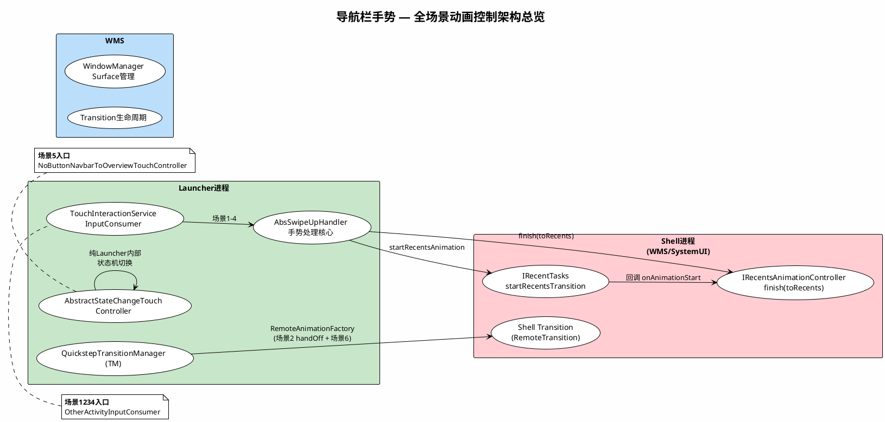

# 导航栏滑动 — 全场景流程 PlantUML 图

## 场景一: 从 App 上滑距离不够 → 回弹到 App (LAST_TASK)

```plantuml
@startuml
!theme plain
skinparam backgroundColor #FEFEFE
skinparam sequenceMessageAlign center

title 场景一: 从App上滑距离不够 → 回弹到App (LAST_TASK)\n动画 = 本地ValueAnimator，非Transition框架

actor "用户手指" as User
participant "SystemUI\nNavigationBar" as NavBar
participant "Launcher进程\nTouchInteractionService" as TIS
participant "OtherActivity\nInputConsumer" as OAIC
participant "AbsSwipeUpHandler\n(Launcher)" as Handler
participant "TaskAnimation\nManager" as TAM
participant "SystemUiProxy\n(Binder桥接)" as Proxy
participant "Shell进程\nIRecentTasks" as Shell
participant "WMS\nWindowManager" as WMS

User -> NavBar: 触摸导航栏 (ACTION_DOWN)
NavBar -> TIS: onInputEvent()
TIS -> OAIC: onMotionEvent(ACTION_DOWN)

OAIC -> OAIC: startTouchTrackingForWindowAnimation()
OAIC -> TAM: mTaskAnimationManager\n.startRecentsAnimation(gestureState, intent)
TAM -> TAM: 检查是否已有运行中的动画\nforceFinish旧动画
TAM -> Proxy: SystemUiProxy.startRecentsActivity(intent, options, listener)
Proxy -> Shell: IRecentTasks.startRecentsTransition(\n  pendingIntent, intent, optionsBundle,\n  IRecentsAnimationRunner)
Shell -> WMS: ★ 启动 Recents Animation ★\n- 获取 App Window Leash (SurfaceControl)\n- 准备 RemoteAnimationTarget[]

User -> NavBar: ACTION_MOVE (滑动中)
NavBar -> TIS -> OAIC: onMotionEvent(ACTION_MOVE)
OAIC -> OAIC: 检查是否 passTouchSlop
OAIC -> Handler: onGestureStarted() & updateDisplacement()
Handler -> Handler: onCurrentShiftUpdated()\n→ applyScrollAndTransform()\n→ TaskViewSimulator 更新 Surface 位置

note right of Handler: 用户实时看到窗口\n跟随手指移动

User -> NavBar: ACTION_UP (松手，距离不够)
NavBar -> TIS -> OAIC: onMotionEvent(ACTION_UP)
OAIC -> OAIC: finishTouchTracking()
OAIC -> Handler: onGestureEnded(velocity, ...)

Handler -> Handler: handleNormalGestureEnd()

== 判定目标 ==

Handler -> Handler: calculateEndTarget()
note right of Handler #FFEBEE: **非Fling + velocity.y > 0\n→ LAST_TASK**

== 回弹动画 (本地，非Transition) ==

Handler -> Handler: animateToProgressInternal()
note right of Handler #E3F2FD: **else分支 (endTarget != HOME):**\nAnimatorSet + ValueAnimator\nmCurrentShift.animateToValue(start, 0)\n\n✅ 这就是回弹动画!\n是本地属性动画，不是Shell Transition

Handler -> Handler: 每帧 onCurrentShiftUpdated()
Handler -> Handler: applyScrollAndTransform()
Handler -> WMS: SurfaceControl.Transaction\n(通过 TaskViewSimulator)

Handler -> Handler: 动画结束\nSTATE_END_TARGET_ANIMATION_FINISHED

== 清理 ==

Handler -> Handler: onSettledOnEndTarget()\n→ case LAST_TASK\n→ resumeLastTask()
Handler -> Handler: mRecentsAnimationController\n.finish(false, null)
Handler -> Shell: IRecentsAnimationController\n.finish(toRecents=false, ...)
Shell -> WMS: 清理 Recents Animation\n恢复 App 前台

@enduml
```

---

## 场景二: 从 App 上滑足够 → 回桌面 (HOME)



---

## 场景三: 从 App 上滑 → 暂停 → 进入多任务 (RECENTS)



---

## 场景四: 从 App 横向滑动 → 切换到另一个 App (NEW_TASK)



---

## 场景五: 从 Launcher 桌面 → 上滑进入多任务 (NORMAL → OVERVIEW)



---

## 场景六: Predictive Back 手势 → 返回桌面



---

## 场景七: 从 App 三键导航 → 进入多任务 (Button Mode)



---

## 全场景对比表


